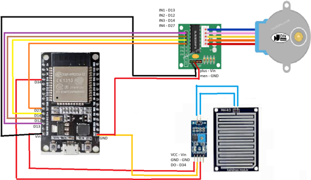

# SMARTDRY: JEMURAN OTOMATIS CERDAS BERBASIS IOT 🌦️👕

Smart Dry adalah sistem jemuran otomatis yang dirancang untuk mengatasi masalah cuaca tak menentu di Indonesia. Alat ini secara otomatis menarik pakaian ke tempat teduh saat hujan turun dan mengeluarkannya kembali saat cerah, serta dapat dipantau melalui aplikasi Blynk.

## 🚀 Fitur Utama
* **Deteksi Hujan Otomatis:** Menggunakan sensor hujan untuk menarik jemuran masuk secara otomatis.
* **Monitoring Real-time:** Memantau status cuaca dan posisi jemuran melalui smartphone.
* **Kontrol Manual:** Mode manual via aplikasi Blynk untuk mengontrol jemuran tanpa menunggu sensor.
* **Notifikasi:** Mengirim notifikasi ke pengguna saat terjadi perubahan status.

## 🛠️ Komponen Hardware
Project ini dibangun menggunakan komponen berikut:
* **Mikrokontroler:** ESP32
* **Sensor:** Modul Sensor Hujan (Raindrops Module)
* **Aktuator:** Motor Stepper + Driver ULN2003

## 🔌 Peta Pin (Wiring)
Berikut adalah konfigurasi pin yang digunakan pada ESP32:
| Komponen | Pin Pada Komponen | Pin Pada ESP32 | Fungsi |
| :--- | :--- | :--- | :--- |
| **Driver Motor Stepper** | IN1 | D13 | Kontrol Gerak |
| (ULN2003) | IN2 | D12 | Kontrol Gerak |
| | IN3 | D14 | Kontrol Gerak |
| | IN4 | D27 | Kontrol Gerak |
| | + (Plus) | Vin | Power (5V) |
| | - (Minus) | GND | Ground |
| **Sensor Hujan** | DO (Digital Out) | D34 | Kirim Data Hujan |
| (Raindrops Module) | VCC | Vin | Power |
| | GND | GND | Ground |

